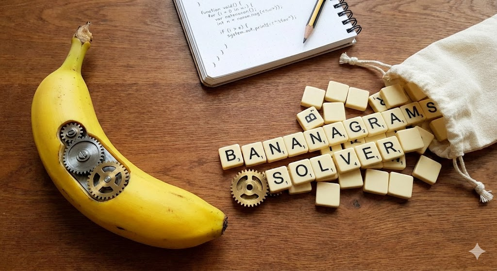

# Bananasolver



## Project Overview
Bananagrams is a word game that challenges players to create a grid of interconnected words using a collection of letter tiles. This project implements a solver that presents a valid board given a list of valid words (aka dictionary) and a list of letters in the pool.

## File Structure
* Dictionary: manages valid words and filtering of the dictionary given a set of letters.
* Board: manages the board and has logic to check that the board is a valid boards, i.e. all touching words are valid.
* main: implements the actual solver logic with the backtracking algorithm.

## Building the Project
You will need CMake and a C++ compiler.

To build the Bananagrams project, follow these steps:

```sh
git clone https://github.com/eduardohenriquearnold/bananasolver.git
cd bananasolver 
mkdir build && cd build
cmake ..
cmake --build .
```

## Running the Application
After building the project, you can run the application using the following command:
```sh
./bananagrams <letters> [<path_to_dictionary>]

# e.g. (assumes dictionary in path `./dictionary.txt`)
./bananagrams aikplawopdaklwdiaskilijeuuaoilmnwiet

# e.g. explicit dictionary location
./bananagrams aikplawopdaklwdiaskilijeuuaoilmnwiet ./path_to_dictionary.txt
```
Note: if the second argument is not provided, the path to the dictionary is assumed to be `./dictionary.txt`.

## Dictionary structure
The dictionary file is a text file with words separated by line breaks.
The [default dictionary file](./dictionary.txt) provided is the valid Scrabble words for the English language.
All words must be UPPERCASE.

## Benchmark
Using i7 1075 @ 2.6Ghz.
```sh
 # Example 1 - 180ms
 ./bananagrams aaaeeeeiiiioooouuuuplplplkjmnnnhgfghtrererrrawqxzp

 # Example 2 - 2.142s
 ./bananagrams aisdjaplomwhnjqeoriwikmnbcvzxbrtgwijfgnhbgvfgdeeeooopliiieuuaertldj
 ```

## Contributing
If you would like to contribute to the project, feel free to fork the repository and submit a pull request with your changes.